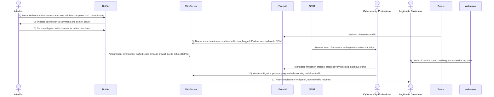

## Overview of Steps in a DDoS Attack 
1. The nefarious threat actor distributes malware to unsuspecting users via an email attachment for a humerous cat video. Infected computers then become part of the BotNet.
2. The BotNet members subsequently initiate connection to the bot herder's command and control server.
3. The attacker, now successfully in command of a bot army, distributes the command to flood an online merchant's webserver with fradulent requests to block legitimate customers from making purchases.
4. The BotNet initiates the attack from numerous infected devices.
5. The merchant's firewall detects the abnormal activity, and blocks some of the most repetitve IP addresses. This alone however will not be effective in remediating the attack, and the firewall alerts the company's SEIM.
6. SEIM alerts the lead cybersecurity professional that there is suspicious activity that must be addressed.
7. A significant ammount of the BotNet traffic is able to break through the firewall.
8. Because the company is equipped with a SEIM and not a SOAR, the response is not fully automated, and customers begin to have difficulty completing orders due to crashes and significant increase in lag while the cybersecutiy team builds a response and investigates manually.
9. The cybersecurity team initiates the mitigation protocol, and reconfigures the firewall to block traffic that has been determined to be malicious.
10. The cybersecurity team also assesses the integrity of the webserver to ensure there are now misconfiguration vulnerabilities and no evidence is present of any other attempted vectors of attack.
11. After successful mitigation of the bot army attack, regular traffic is able to resume over the merchant's website.

