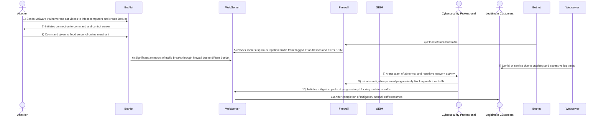

```mermaid
sequenceDiagram
    actor Attacker
    participant BotNet
    participant WebServer
    participant Firewall
    participant SEIM 
    actor Cybersecurity Professional
    actor Legitimate Customers
    Attacker->>+BotNet: 1) Sends Malware via humerous cat videos to infect computers and create BotNet
    BotNet->>+Attacker: 2) Initiates connection to command and control server 
    Attacker->>+BotNet: 3) Command given to flood server of online merchant
    Botnet->>+Firewall: 4) Flood of fradulent traffic 
    Firewall->>+WebServer: 5) Blocks some suspicious repetitve traffic from flagged IP addresses and alerts SEIM
    BotNet->>+WebServer: 6) Significant ammount of traffic breaks through firewall due to diffuse BotNet
    Webserver->>+Legitimate Customers: 7) Denial of service due to crashing and excessive lag times
    SEIM->>+Cybersecurity Professional: 8) Alerts team of abnormal and repetitive network activity
    Cybersecurity Professional->>+Firewall: 9) Initiates mitigation protocol progressively blocking malicious traffic
    Cybersecurity Professional->>+WebServer: 10) Initiates mitigation protocol progressively blocking malicious traffic
    WebServer->>+Legitimate Customers: 11) After completion of mitigation, normal traffic resumes

```
## Overview of Steps in a DDoS Attack 
1. 

