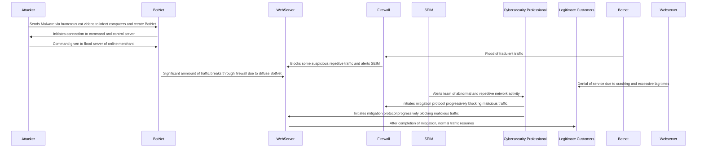

```mermaid
sequenceDiagram
    participant Attacker
    participant BotNet
    participant WebServer
    participant Firewall
    participant SEIM 
    participant Cybersecurity Professional
    participant Legitimate Customers
    Attacker->>+BotNet: Sends Malware via humerous cat videos to infect computers and create BotNet
    BotNet->>+Attacker: Initiates connection to command and control server 
    Attacker->>+BotNet: Command given to flood server of online merchant
    Botnet->>+Firewall: Flood of fradulent traffic 
    Firewall->>+WebServer: Blocks some suspicious repetitve traffic and alerts SEIM
    BotNet->>+WebServer: Significant ammount of traffic breaks through firewall due to diffuse BotNet
    Webserver->>+Legitimate Customers: Denial of service due to crashing and excessive lag times
    SEIM->>+Cybersecurity Professional: Alerts team of abnormal and repetitive network activity
    Cybersecurity Professional->>+Firewall: Initiates mitigation protocol progressively blocking malicious traffic
    Cybersecurity Professional->>+WebServer: Initiates mitigation protocol progressively blocking malicious traffic
    WebServer->>+Legitimate Customers: After completion of mitigation, normal traffic resumes

```
